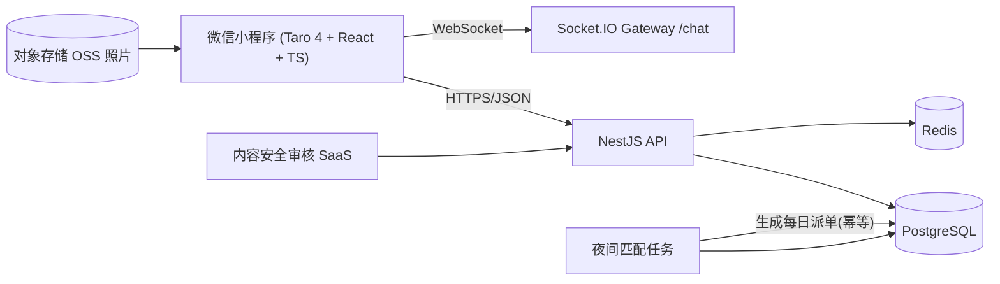

# 架构设计

## 总体架构



## 技术选型与理由

| 层 | 选型 | 理由 |
|---|---|---|
| 客户端 | 微信小程序（Taro 4 + React + TS） | 校园场景传播成本最低；Taro 保留多端可能性 |
| 后端 | NestJS + TypeORM | 与前端共享 TS 类型（`@sdumeet/shared`），模块化清晰，学生团队上手快 |
| 数据库 | PostgreSQL | jsonb 存档案/向量/报告，事务保证配对一致性 |
| 缓存 | Redis | 验证码、每日派单状态、限流（骨架阶段可后接） |
| IM | Socket.IO 自研起步 | 1v1 场景简单；量级上来后可平滑替换为腾讯云 IM |
| 审核 | 第三方 SaaS（数美/天御） | 不要自研内容安全 |

## 关键决策（ADR 摘要）

1. **共享包 `@sdumeet/shared`**：枚举、八校区常量、问卷题库、向量算法三端共用，避免双端漂移；
2. **匹配计算离线化**：每日派单由定时任务夜间生成（当前骨架提供 `POST /matching/generate` 幂等接口），线上只读；
3. **双向心动 = 匹配**：`likes` 表互查决定配对，简单可靠；推荐（recommendations）只负责曝光；
4. **问卷只下发题目，权重留在服务端**：防止用户逆向计分规则刷分；
5. **开发环境 `synchronize: true`，生产必须 migration**：已在 `app.module.ts` 注释说明。

## 模块依赖

```
auth ──▶ users
survey ──▶ users
matching ──▶ users, survey
chat ──▶ users, matching（配对后建会话）
```

## 数据流：每日派单

1. 用户完善档案（profile）并提交问卷（survey_answers）；
2. 定时任务读取候选池（已验证、未隐藏、未脱单）；
3. 匹配引擎硬过滤（取向/年龄/校区距离/吸烟/同院系/曝光配额）→ 软打分（价值观余弦 + 兴趣 Jaccard + 活跃度 − 距离惩罚）→ Top5；
4. 写入 `recommendations`（当日幂等）；
5. 小程序拉取今日批次并展示「为什么是 TA」报告。

## 数据流：双向心动

1. 用户对推荐心动 → `likes` 写入 (userId → candidateId)；
2. 服务端反查 (candidateId → userId) 是否已存在；
3. 存在 → 写入 `matches`，双方 profile.pairedWith 互指，创建 `conversations`；
4. 双方在「消息」页解锁聊天。
