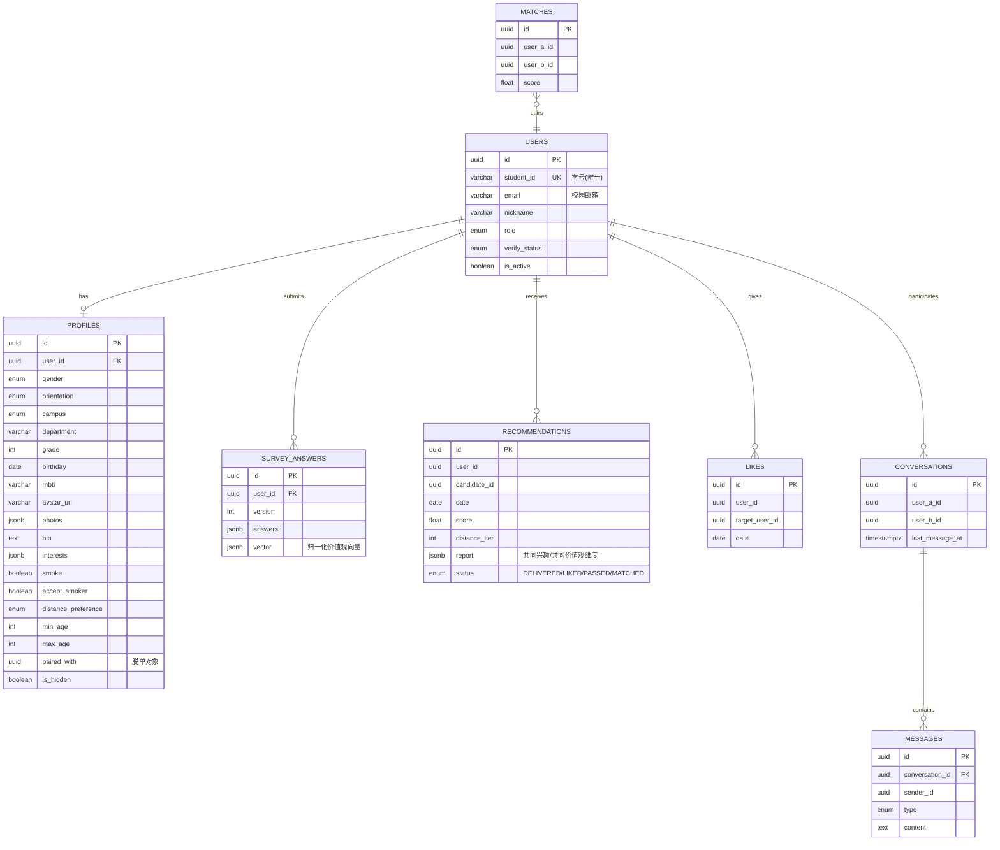

# 数据模型

## 索引（骨架已含关键索引，生产前需压测补充）

- `users.student_id` 唯一索引（一人一号）
- `recommendations(user_id, date)`（当日批次查询）
- `recommendations(candidate_id, date)`（曝光配额统计）
- `likes(target_user_id, user_id)`（互查是否双向心动）
- `survey_answers(user_id, submitted_at)`（取最新一次作答）

## 数据保留策略

| 数据 | 策略 |
|---|---|
| 推荐记录 | 保留 90 天，过期归档 |
| 消息 | 注销用户 30 天内物理删除 |
| 问卷作答 | 随注销删除；匿名统计可保留聚合结果 |
| 日志 | 90 天滚动，脱敏 |

## 扩展预留

- `photos` 用 jsonb，后续可平滑迁移到独立 media 表；
- `interests` 用 jsonb 标签数组，后续可扩展为 `tags` 维度表做兴趣图谱；
- 内容审核结果建议单独建 `audit_logs` 表（骨架未含，接审核 SaaS 时补充）。
